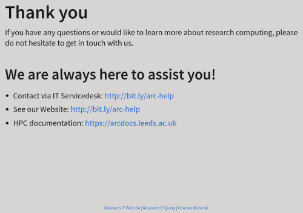

# Research Computing Slides

This is a repository for ARCTraining Quarto slides collection.

## Repository Setup

This repository was created from [Sparrow0hawk/quarto-revealjs-template](https://github.com/Sparrow0hawk/quarto-revealjs-template).

This repository is used to publish a [RevealJS](https://revealjs.com/) website that has been written in
[Quarto](https://www.quarto.org). It includes a [GitHub Action](https://docs.github.com/en/actions) which will convert
the Quarto source to HTML and publish them via [GitHub Pages](https://pages.github.com/).

Its a useful way of making slides portable as they are then available via the URL and naturally the slides are version
controlled.

## Standard Presentation

A standard Research Computing presentation includes

- Title slide
- Team slide
- End slide
- Footer

The `meta` definition for a standard presentation is:

```yml
---
format: 
  revealjs:
    navigation-mode: linear
    controls-layout: bottom-right
    controls: true
    footer: "[Research IT Website]() | [Research IT Query]() | [Courses Material]()"
code: Course Code
name: Course Name
---
```

*Note that `code` and `name` are `meta` variables used to generate the title slide (see bellow).*

### The Title Slide

The title slide is defined in the `_title.qmd` file, and is included in the presentation file via the `` command. This slide has three elements:

- Title: value retrieved via `meta.code`
- Subtitle: value retrieved via `meta.name`
- Image

The title slide should looks like:


*Tip: if you want to create a title slide without title or subtitle, you can leave the `meta` values for `code` or `name` empty.*

### The Team Slide

The team slide is defined in the `_team.qmd` file, and is included in the presentation file via the `` command. This slide has two variables elements:

- Staff: value retrieved from `_variables.yml` file via ``
- IT Servicedesk link: value retrieved from `_variables.yml` file via ``

*Tip: If any of these values needed to be updated, please do this via `_variables.yml` file, and then, all standard presentations are going to be automatically updated.*

The team slide should looks like:


### The End Slide

The end slide is defined in the `_end.qmd` file, and is included in the presentation file via the `` command. This slide has three variables elements:

- IT Servicedesk link: value retrieved from `_variables.yml` file via ``
- ARC Website: value retrieved from `_variables.yml` file via ``
- HPC documentation: value retrieved from `_variables.yml` file via ``

*Tip: If any of these values needed to be updated, please do this via `_variables.yml` file, and then, all standard presentations are going to be automatically updated.*

The end slide should looks like:



## New Standard Presentation

To start a new standard presentation, start by creating a copy of the file `template.qmd`.
Then, rename the new file using the training code, for example `hpc0.qmd`.
Now, you will have to edit this new file and change the `meta` information (`code` and `name`) to reflect the training course content. For example, the `meta` for the `HPC0` is:

```yml
---
format: 
  revealjs:
    navigation-mode: linear
    controls-layout: bottom-right
    controls: true
    footer: "[Research IT Website]() | [Research IT Query]() | [Courses Material]()"
code: HPC0
name: Introduction to Linux for HPC
---
```

Done! The standard presentation is created. You can write the main content for the presentation by replacing the `## Slide A`, `## Slide B` and `## Slide C` temporary content.

## Write your slides

You are now ready to create your slides by editing the `index.qmd` in the root of the repository. For more information
on writing RevealJS slides in Quarto see the [RevealJS](https://quarto.org/docs/presentations/revealjs/) guide and the
[Revealjs Reference](https://quarto.org/docs/reference/formats/presentations/revealjs.html).

## Publish Locally

You will need to run `quarto publish gh-pages` once locally before deploying this template.

## pre-commit

A basic [pre-commit](https://pre-commit.com) configuration is included (see ~.pre-commit-config.yaml~) however to use it
you will have to install `pre-commit` in your cloned repository. This requires `pre-commit` to be installed on your
system or within a Python Virtual Environment. To find out more about installing and configuring `pre-commit` see the
article [pre-commit : Protecting your future self](https://rse.shef.ac.uk/blog/pre-commit/).

# Extensions

There is a growing number of useful [Quarto extensions](https://quarto.org/docs/extensions/).

## QR Code generation

The [quarto-qrcode](https://github.com/jmbuhr/quarto-qrcode) extension  is particularly useful as it simplifies
generating and embedding [QR Codes](https://en.wikipedia.org/wiki/QR_code) that link to websites in your slides.
